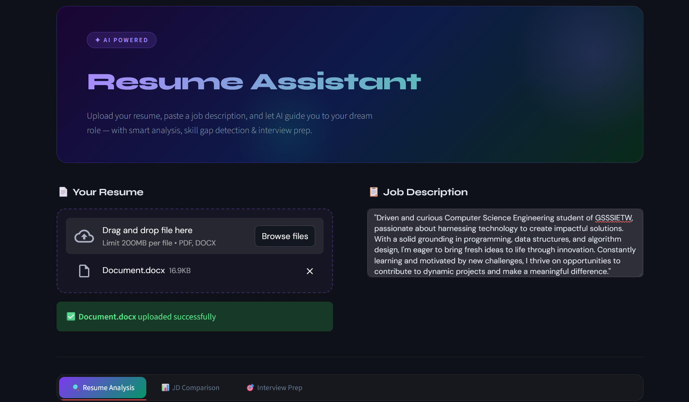
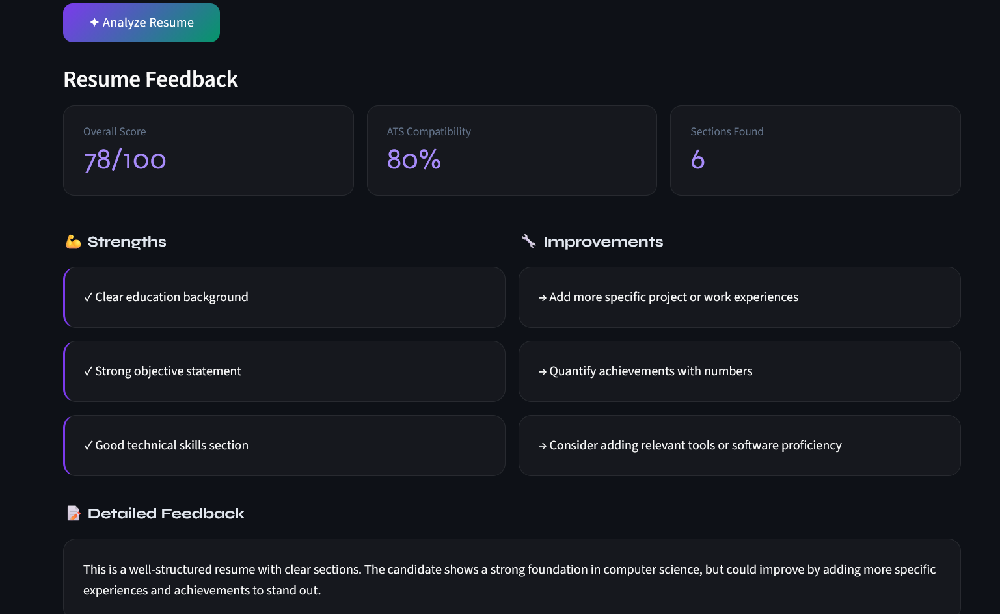
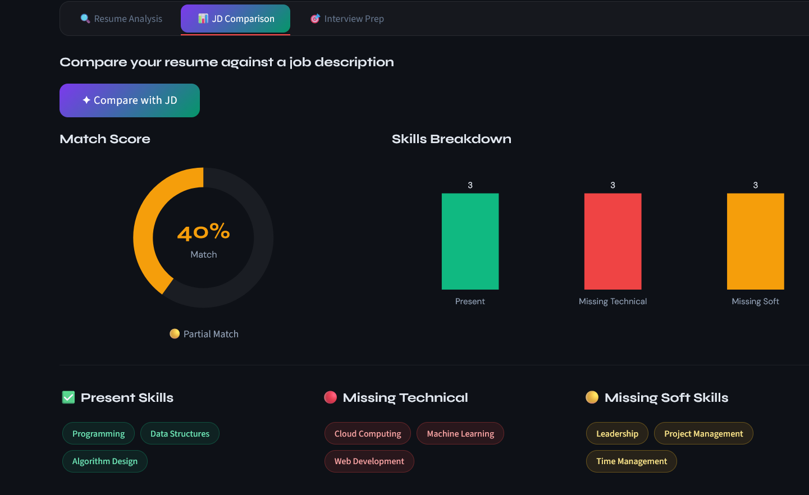
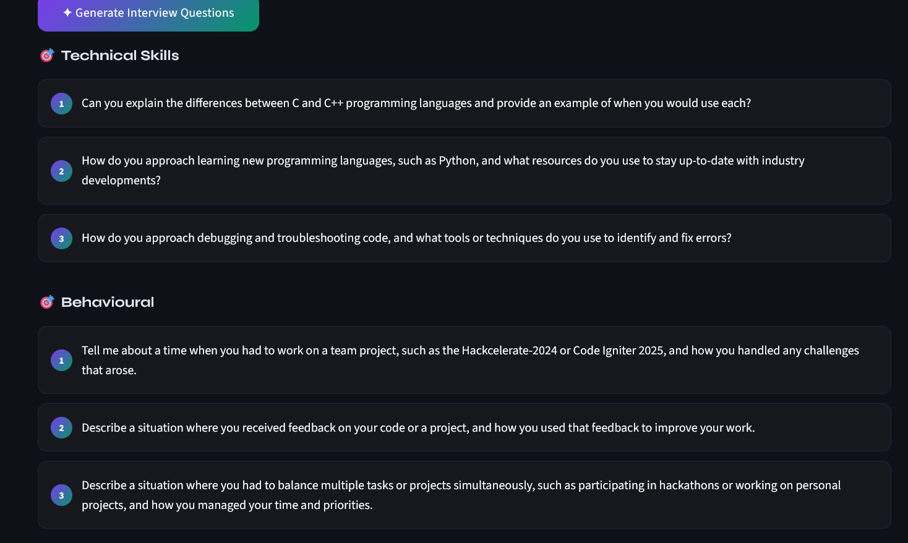

# 🧠 AI Resume Assistant


> An AI-powered resume analysis tool that helps you land your dream job! Upload your resume, paste a job description, and let AI do the rest.

---

## 📸 Screenshots

### 🏠 Home Page


### 📄 Resume Analysis


### 📊 JD Comparison


### 🎯 Interview Prep


---

## ✨ Features

| Feature | Description |
|---|---|
| 📄 **Resume Analysis** | Get instant AI feedback, ATS score & improvement tips |
| 📊 **JD Comparison** | Compare resume against job description with match score chart |
| 🎯 **Interview Prep** | Get AI-generated tailored interview questions by category |

---

## 🛠️ Tech Stack

- **Frontend** — Streamlit + Custom CSS
- **Backend** — FastAPI
- **AI Model** — Groq (LLaMA 3.3 70B) — Free & Fast ⚡
- **PDF Parsing** — pdfminer.six
- **Charts** — Plotly

---

## 🚀 Getting Started

### Prerequisites
- Python 3.10+
- Free Groq API key from 👉 [console.groq.com](https://console.groq.com)

### Step 1 — Clone the repository
```bash
git clone https://github.com/nikita-pawar487/AI-Resume-Assistant.git
cd AI-Resume-Assistant
```

### Step 2 — Create a virtual environment
```bash
python -m venv venv
venv\Scripts\activate        # Windows
source venv/bin/activate     # Mac/Linux
```

### Step 3 — Install dependencies
```bash
pip install fastapi uvicorn streamlit pdfminer.six python-docx plotly groq
```

### Step 4 — Set your Groq API key
```bash
# Windows PowerShell
$env:GROQ_API_KEY="your_groq_key_here"

# Mac/Linux
export GROQ_API_KEY="your_groq_key_here"
```

### Step 5 — Start the backend
```bash
uvicorn main:app --reload
```

### Step 6 — Open a new terminal and start the frontend
```bash
venv\Scripts\activate
streamlit run app.py
```

### Step 7 — Open your browser
```
http://localhost:8501
```

---

## 📁 Project Structure

```
AI-Resume-Assistant/
├── app.py              # Streamlit frontend
├── main.py             # FastAPI backend
├── run.bat             # Quick start script (Windows)
├── screenshots/        # App screenshots
├── .gitignore
└── README.md
```

---

## 💡 How to Use

1. **Upload** your resume (PDF or DOCX)
2. **Paste** the job description
3. Click **Analyze Resume** for AI feedback & scores
4. Click **Compare with JD** to see your match score & skill gaps
5. Click **Generate Interview Questions** to prepare for interviews

---

## 🤝 Contributing

Pull requests are welcome! Feel free to open an issue or submit a PR.

---

## 👩‍💻 Author

**Nikita Pawar** — [github.com/nikita-pawar487](https://github.com/nikita-pawar487)

---

⭐ If you found this helpful, please give it a star on GitHub!
